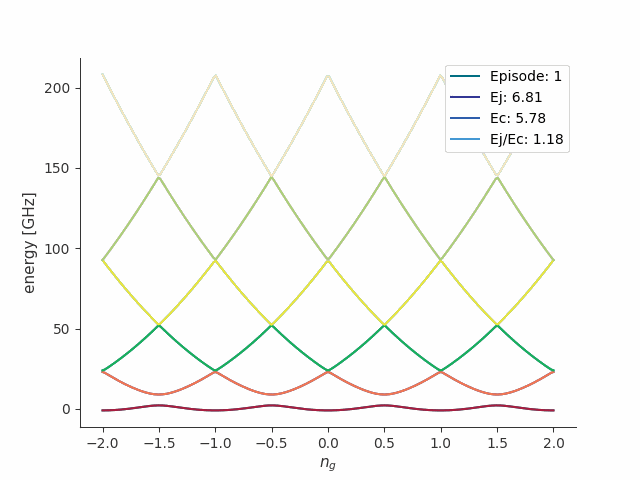
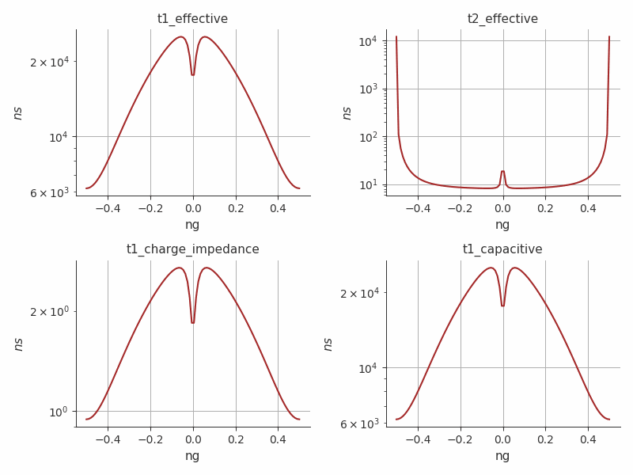
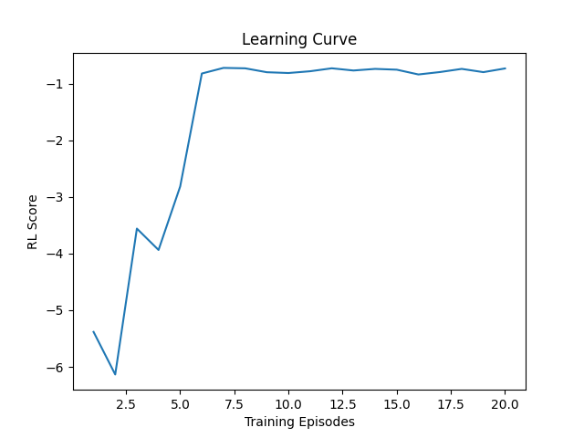
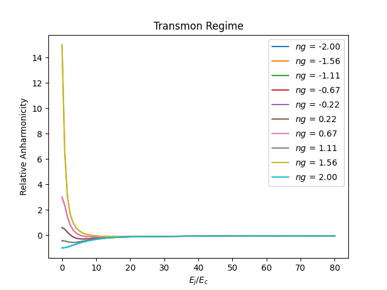

[](https://www.python.org/downloads/source/)
[](https://www.tensorflow.org/install/source?#cpu)
[](https://www.tensorflow.org/install/source_windows?#gpu)

<!-- Logo: -->
<div align="center">
  <a href="https://qucai-lab.github.io/">
    
  </a>
</div>

<!-- Title: -->
<div align="center">
  <h1> Reinforce Transmon </h1>
  <h2> Finding the Transmon Regime with DDPG Algorithm <h2>
</div>

# Core Dependencies

<a href="https://www.python.org/" target="_blank" rel="noopener noreferrer"></a>
<a href="https://matplotlib.org" target="_blank" rel="noopener noreferrer"></a>
<a href="https://numpy.org/" target="_blank" rel="noopener noreferrer"></a>
<a target="_blank" href="https://www.tensorflow.org/"></a>
<a href="https://github.com/scqubits"></a>
<br>

# About

A simple project to demonstrate how to find the transmon regime of circuit-based superconducting [transmon qubits](https://journals.aps.org/pra/abstract/10.1103/PhysRevA.76.042319) using the [Deep Deterministic Policy Gradient (DDPG)](https://arxiv.org/abs/1509.02971) algorithm. The transmon regime is an operating condition where the ratio between two energy parameters, $E_j$ (Josephson energy) and $E_c$ (charging energy), is increased ($E_j/E_c >>1$) to make the solid-state qubit insensitive to charge fluctuations. One way of achieving this regime is by increasing the overall [capacitance value](https://github.com/QuCAI-Lab/circuit-qed) $C_{\Sigma}$. In this regime, every point along the charge ($ng$) axis becomes a sweet spot.

<!-- Anharmonicity GIF -->
<br>
<div align="center">
  <a href="#"></a>
</div>

<!-- Coherence GIF -->
<br>
<div align="center">
  <a href="#"></a>
</div>

<!-- RL Score -->
<br>
<div align="center">
  <a href="#"></a>
</div>

<!-- Transmon Regime -->
<br>
<div align="center">
  <a href="#"></a>
</div>

# Technologies

- `NumPy:` replay buffer class and environment class.
- `scQubits:` transmon qubit, anharmonicity, and coherence.
- `TensorFlow:` actor-critic neural networks and DDPG agent class.
- `Configparser:` parsing of configuration data/hyperparameters.
- `Imageio:` gif.
- `Matplotlib:` plotting.

# Implementation details

- DDPG: is a `model-free` (no transition probability) `off-policy` (uses `replay buffer`) actor-critic algorithm that combines elements of policy gradient methods with deep Q-learning to train a `deterministic policy`. DDPG is an extension of DQN for `continuous action space`. It uses `temporal difference learning` (bootstrapping) and a experience replay buffer to learn the Q-value (represented by the Critic network). Unlike DQN, DDPG does not use $epsilon$-greedy policy (discrete action spaces only) for action selection. To ensure enough exploration, a `gaussian noise` is added to the action sampled from the policy. In DDPG, the behavior policy for action selection is derived from the actions generated by the Actor network. Recall that DDPG may suffer from the `deadly triad issue` since it leverages off-policy learning, neural networks, and bootstrapping simultaneously (see [the-world-of-rl](https://github.com/QuCAI-Lab/the-world-of-rl/blob/dev/theory/rl-theory.ipynb)).

  - Environment: the environment was built to be gym-compliant and depends on scQubits.
  - Actor-Critic networks: the neural networks are both MLPs with two hidden layers. For deterministic policy and continuous action space, `tanh activation` function is used in the last layer of the actor network with `action_dim` number of neurons.
  - Reward function: maximizes the qubit anharmonicity and minimizes the anharmonicity difference between energy offsets.

# Set up the environment

I recommend Conda for environment management.

## CPU

```bash
conda update -yn base -c defaults conda && conda env create -f cpu_environment.yml && conda activate transmon-cpu
```

## NVIDIA GPU-enabled

Check the required package versions to install [tensorflow with cudnn and cudatoolkit](https://www.tensorflow.org/install/source_windows?hl=pt-br#gpu) for a given GPU driver. The following install works for a GeForce GTX 1650 with [NVIDIA Studio Driver version 531.61](https://www.nvidia.com/download/driverResults.aspx/204244/en-us/), `TensorFlow==2.9` and `cudatoolkit=11.2`.

```bash
conda env create -f gpu_environment.yml && conda activate transmon-gpu
```

Check GPU:

```bash
python -c "import tensorflow as tf; print(tf.config.list_physical_devices('GPU'))"
```

`>>> [PhysicalDevice(name='/physical_device:GPU:0', device_type='GPU')]`

Note: Keras is shipped standard with TensorFlow.

# Training

```ShellSession
Required Arguments:
  config_file (str)          Name of the configuration file containing hyperparameters
  checkpoint (str)           'True' for loading pre-trained model.
  evaluation_mode (str)      'True' for evaluation (no training).
```

```bash
python src/main.py 'config.cfg' 'False' 'False'
```

Plot the transmon regime curve for different ng values:

```bash
python src/utils/transmon_regime.py
```

# To do

Modify the reward function to simultaneously maximize both $T_1$ (dependent on the dielectric material) and coherence time $T_2$ under noise channels.

# Acknowledgement

The author would like to acknowledge [@Yun-Chih Liao](https://github.com/ycldingo) (NTU/UQ), Professor [Hsi-Sheng Goan](https://web.phys.ntu.edu.tw/goan/) (NTU), and Professor [Shu-Hsien Liao](https://scholar.lib.ntnu.edu.tw/en/persons/shu-hsien-liao) (NTNU) for their advice and brainstorming sessions. Recognition is also extended to [@philtabor](https://github.com/philtabor) for open-sourcing a TF2 implementation of the DDPG algorithm, upon which this implementation is based.
